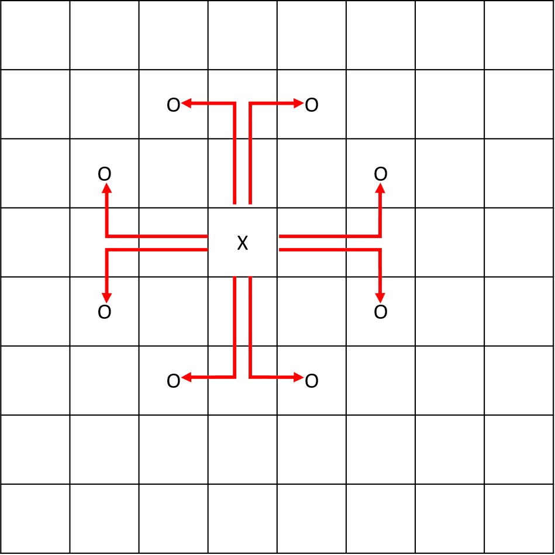
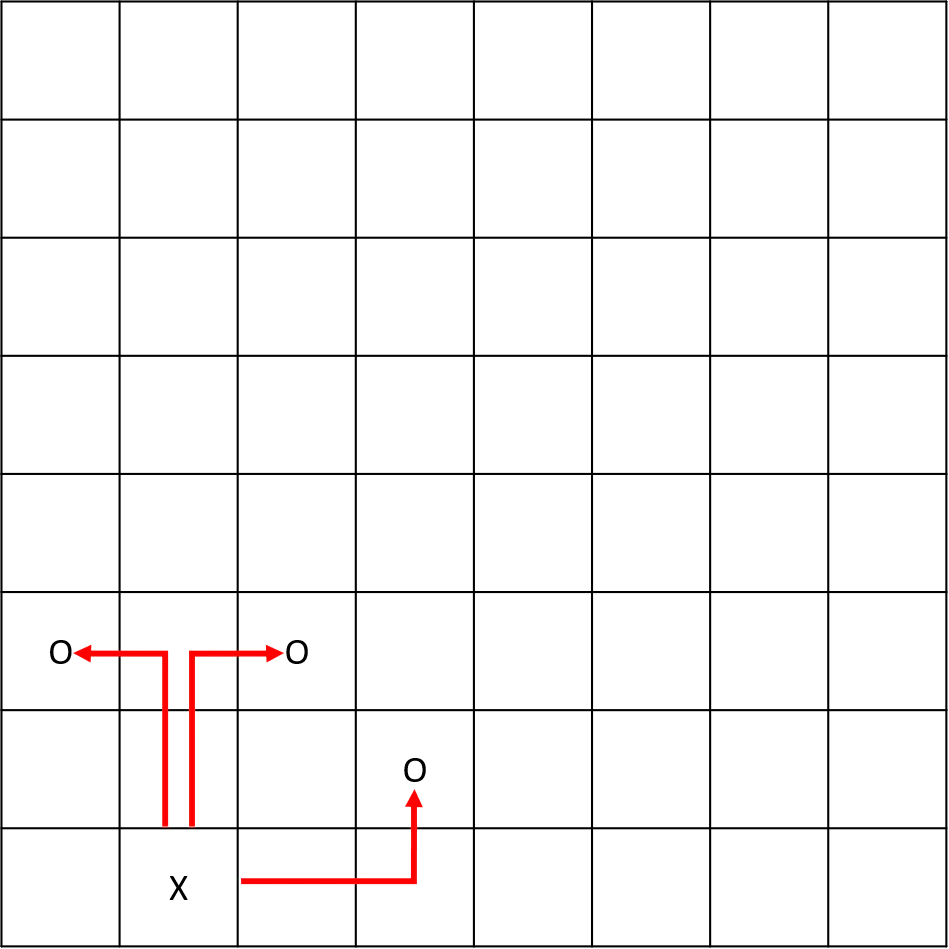
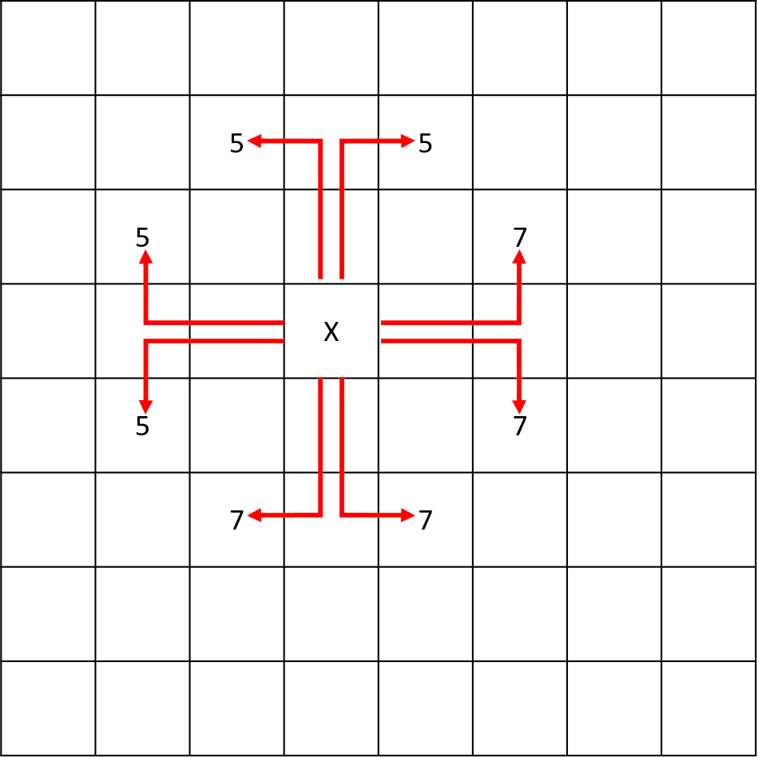
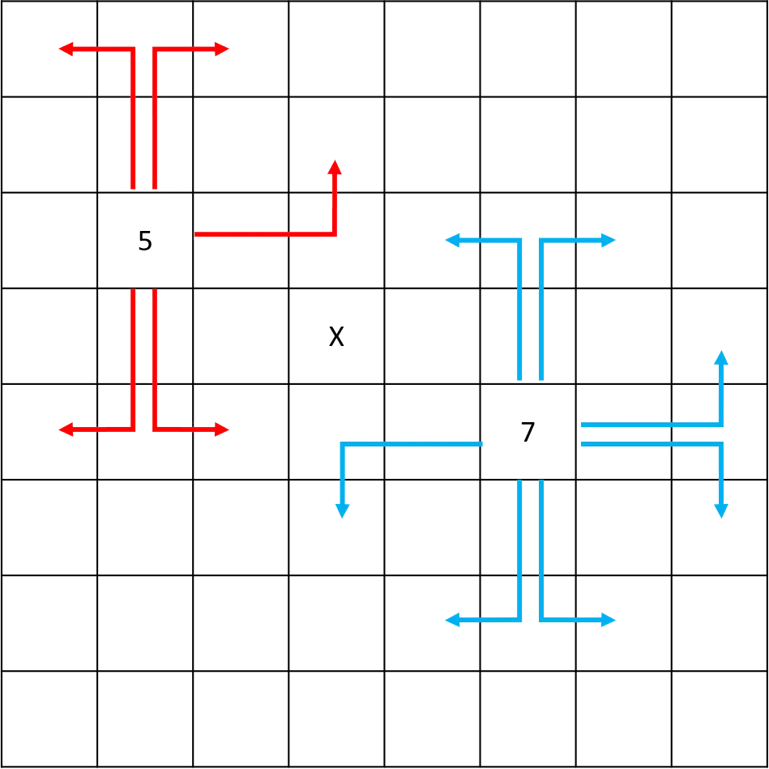

# Knight's Tour Puzzle

## Project description

The Knight’s Tour is a fun puzzle where you move the knight so that it visits every square of the chessboard once. The rules are simple and fun, but the game is really hard to master. Let’s make a program to find a solution! This project will help you practice concepts frequently tested in technical interviews at top tech companies.

[View more](https://hyperskill.org/projects/141)


## Stage 1/6: Setting up the board

### Description

The knight's tour problem uses a chessboard and a knight. Don't worry, you won't need to know the chess basics for this project, you only need to know how a knight moves on the board.

A standard chess board is an 8x8 square on which the chess pieces are placed. For this project, we will use a coordinate system (x,y) to label each square on the chessboard, where (1,1) is the bottom left, and (8,8) is the top right.


The knight is a chess piece. It moves in an L-shape and can jump over other pieces. It has to move 2 squares horizontally and 1 square vertically, or 2 squares vertically and 1 square horizontally.


The rules of the knight's tour are as follows:

- The knight can start at any square.
- The knight must visit every square by moving in the L-shape.
- The knight can visit each square only once.
- The knight can finish anywhere on the board. This is called an 'open' tour of the board.
- You win if you visit every square on the board.
- You lose if you fail to visit every square only once without revisiting it.

### Objectives

Let's get started by setting up the puzzle:

1. Ask the user for the knight's starting position.
2. If the user input contains non-integer numbers you should print `Invalid dimensions!`.
3. If the user input contains more than 2 numbers you should print `Invalid dimensions!`.
4. If the user input numbers out of bounds of the game field you should print `Invalid dimensions!`.
5. Display the 8x8 chessboard with the knight in this position. You should display a frame around the board and mark the column and row numbers. You should use an underscore `_` for an empty cell with a space in between them, and an `X` for the knight's position.

### Example

The greater-than symbol followed by space (`> `) represents the user input. Note that it's not part of the input.
```text
Enter the knight's starting position: > 1 3
 -------------------
8| _ _ _ _ _ _ _ _ |
7| _ _ _ _ _ _ _ _ |
6| _ _ _ _ _ _ _ _ |
5| _ _ _ _ _ _ _ _ |
4| _ _ _ _ _ _ _ _ |
3| X _ _ _ _ _ _ _ |
2| _ _ _ _ _ _ _ _ |
1| _ _ _ _ _ _ _ _ |
 -------------------
   1 2 3 4 5 6 7 8 
```


## Stage 2/6: And now for something completely different!

### Description

The traditional version of the puzzle uses a standard chessboard, but you can use a board of any size. You can try smaller boards like 5×5, rectangular boards like 4×8, or even non-rectangular boards with some squares missing! Here, we will only focus on rectangular boards. Note that the board is guaranteed to have a solution if the smallest dimension is at least 5. Smaller boards may not have a solution.

### Objectives

In this stage, you should modify your program to do the following:

1. Ask the user for the board's dimensions using X for columns and Y for rows.
2. If the board's dimensions contain non-integer numbers print `Invalid dimensions!`.
3. If the board's dimensions contain more than 2 numbers print `Invalid dimensions!`.
4. If the board's dimensions contain negative numbers print `Invalid dimensions!`.
5. If invalid dimensions were provided by the user, ask them for valid dimensions again after outputting `Invalid dimensions!`.
6. Once the starting position is determined, check whether it is valid as in the previous stage.
7. If not, you should show the `Invalid position!` error message and then prompt the user for another starting position.
8. Draw the board.

Use an underscore symbol `_` to mark empty board squares; the number of underscore symbols for each empty square should be chosen according to the total number of cells: there should be as many underscores for each cell as there are digits in the total number of cells. For example, a 10 × 10 board has 100 spaces, so your placeholder should be `___` for an empty cell. If your board dimension is 6 x 5, your placeholder will be `__`. This will be used in later stages.

Make sure that the column numbers are exactly under the placeholders for the given column. Also, make sure your column, row numbers, and the knight position are aligned to the right: for example, the knight positions should be marked as `_X` or `__X` (instead of `X_` or `_X_`), depending on the number of underscores for each square.

The border's length also depends on the size of the field. Use the following formula to calculate the length of the required border: `column_n * (cell_size + 1) + 3`, where `column_n` is the number of columns, and `cell_size` is the length of a placeholder for one cell.

### Examples

The greater-than symbol followed by space (`> `) represents the user input. Note that it's not part of the input.

**Example 1**
```text
Enter your board dimensions: > 6 5
Enter the knight's starting position: > 4 2
 ---------------------
5| __ __ __ __ __ __ |
4| __ __ __ __ __ __ |
3| __ __ __ __ __ __ |
2| __ __ __  X __ __ |
1| __ __ __ __ __ __ |
 ---------------------
    1  2  3  4  5  6
```

**Example 2**
```text
Enter your board dimensions: > 4 4
Enter the knight's starting position: > 8 8
Invalid position!
Enter the knight's starting position: > -1 2
Invalid position!
Enter the knight's starting position: > 2 2
 ---------------
4| __ __ __ __ |
3| __ __ __ __ |
2| __  X __ __ |
1| __ __ __ __ |
 ---------------
    1  2  3  4
```

**Example 3**
```text
Enter your board dimensions: > 10 10
Enter the knight's starting position: > 5 5
  -------------------------------------------
10| ___ ___ ___ ___ ___ ___ ___ ___ ___ ___ |
 9| ___ ___ ___ ___ ___ ___ ___ ___ ___ ___ |
 8| ___ ___ ___ ___ ___ ___ ___ ___ ___ ___ |
 7| ___ ___ ___ ___ ___ ___ ___ ___ ___ ___ |
 6| ___ ___ ___ ___ ___ ___ ___ ___ ___ ___ |
 5| ___ ___ ___ ___   X ___ ___ ___ ___ ___ |
 4| ___ ___ ___ ___ ___ ___ ___ ___ ___ ___ |
 3| ___ ___ ___ ___ ___ ___ ___ ___ ___ ___ |
 2| ___ ___ ___ ___ ___ ___ ___ ___ ___ ___ |
 1| ___ ___ ___ ___ ___ ___ ___ ___ ___ ___ |
  -------------------------------------------
      1   2   3   4   5   6   7   8   9  10
```


## Stage 3/6: Where to next?

### Description

Once the board is set up, let's see where our knight can move.

The knight moves in an L-shape, so it has to move 2 squares horizontally and 1 square vertically, or 2 squares vertically and 1 square horizontally.

Here are two examples showing how the knight can move. In the first example, there are 8 possible moves for the knight:



In the second example, there are only 3 possible moves since the knight cannot leave the board:



### Objectives

In this stage, you should modify your program to do the following:

1. Check all 8 possible moving directions from the starting position.
2. If the move is possible, mark the landing position with the letter 'O'.
3. If the move is not possible, no action is required.

Don't forget that column and row numbers, as well as the knight position and the 'O' letter for the landing position, should be aligned to the right. For example, for a three-symbols long placeholder, the landing position should look like `__O`.

Please, don't forget about functional decomposition: splitting your code into reusable functions is very important for the next stages.

### Examples

The greater-than symbol followed by space (`> `) represents the user input. Note that it's not part of the input.

**Example 1**
```text
Enter your board dimensions: > 6 5
Enter the knight's starting position: > 4 2

Here are the possible moves:
 ---------------------
5| __ __ __ __ __ __ |
4| __ __  O __  O __ |
3| __  O __ __ __  O |
2| __ __ __  X __ __ |
1| __  O __ __ __  O |
 ---------------------
    1  2  3  4  5  6
```

**Example 2**
```text
Enter your board dimensions: > 3 4
Enter the knight's starting position: > 2 2

Here are the possible moves:
 ------------
4|  O __  O |
3| __ __ __ |
2| __  X __ |
1| __ __ __ |
 ------------
    1  2  3
```

**Example 3**
```text
Enter your board dimensions: > 1 2
Enter the knight's starting position: > 1 2

Here are the possible moves:
 -----
2| X |
1| _ |
 -----
   1
```


## Stage 4/6: Looking ahead

### Description

It is time to find a winning strategy. At each point, the player may have different move options. We could check every route combination, but it would take a long-long time. With a computer program, we could use brute force to check every possible route until we find a solution. However, this is inefficient and could take a while even for a computer. So what is the best way to crack this puzzle? **Warnsdorff's rule** is here to help us.

Warnsdorff's rule is a strategy that helps choose the best move based on the knight's position and the board status. To apply it, we need to do the following:

1. Check if each of the eight knight's moves is possible;
2. Check how many moves are possible from that landing position.

Here is an example of the algorithm:



There are 8 possible moves from the starting position. The number shows how many moves there are from that position. Here is an example to illustrate the next possible moves. Note that the highest number is 7, since you cannot revisit the square you moved from, and the lowest number is 0 which indicates a dead-end.



### Objectives

In this stage, you should modify your program to do the following:

1. From the starting position, check all eight possible moving directions.
2. If the move is possible, mark the square with a number that indicates how many distinct moves are possible from that square.
3. If the move is not possible, no action is required.

Please, don't forget about functional decomposition: splitting your code into reusable functions is very important for the next stages.

### Examples

The greater-than symbol followed by space (`> `) represents the user input. Note that it's not part of the input.

**Example 1**
```text
Enter your board dimensions: > 6 5
Enter the knight's starting position: > 4 2

Here are the possible moves:
 ---------------------
5| __ __ __ __ __ __ |
4| __ __  5 __  3 __ |
3| __  5 __ __ __  3 |
2| __ __ __  X __ __ |
1| __  2 __ __ __  1 |
 ---------------------
    1  2  3  4  5  6
```

**Example 2**
```text
Enter your board dimensions: > 3 4
Enter the knight's starting position: > 2 2

Here are the possible moves:
 ------------
4|  1 __  1 |
3| __ __ __ |
2| __  X __ |
1| __ __ __ |
 ------------
    1  2  3
```

**Example 3**
```text
Enter your board dimensions: > 1 2
Enter the knight's starting position: > 1 2

Here are the possible moves:
 -----
2| X |
1| _ |
 -----
   1
```
