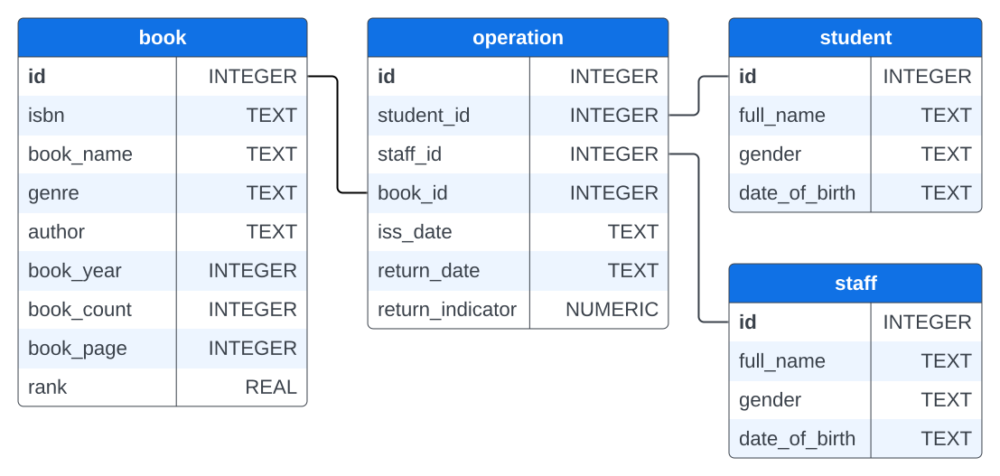

# Library Management System

## Project description

Good library management is all about keeping records. In the past, special logbooks were reserved for these purposes. The modern solution are databases, an excellent tool for storing big chunks of information — anything, from images to text, single-character data to thousands of digits. You don't even need to keep this data on your computer! Let's see how databases can help you with running a library.

[View more](https://hyperskill.org/projects/272)


## Stage 1/4: Create a table

### Description

We need to store a lot of information in the library database: return dates, members' names, books available, and much more. For this purpose, we should create tables and match their columns with the correct data types. Let's get started!

### Objectives

Take a look at the database outline below.



The table `book` contains information about all the books in the library: title, author's name, genre, number of pages and year of publication, rating, and how many books are available.

The `student` and `staff` tables include information about the employees who issue books and readers.

The `operation` table includes information about transactions that have occurred: who issued the book and to whom, and the date of issue (`iss_date`), as well as the planned return date (`return_date`) and the return indicator (`return_indicator`, issued — `0`, returned — `1`).

Your task is to create tables, set the data types for the columns, and apply the SQL constraints.

Pay attention to the following:

- Don’t forget to highlight the primary key and foreign key features. On the scheme, they are marked in bold and connected with lines.
- Restrict the columns to `NOT NULL`.
- You do not have to worry about generating unique identifiers for rows within a table if its primary key column is declared as `INTEGER PRIMARY KEY`.

Use the SQLite syntax for creating tables. The following links could help you to find more information on data types and foreign key in SQLite: [Datatypes in SQLite](https://www.sqlite.org/datatype3.html), [Foreign Key Support](https://www.sqlite.org/foreignkeys.html).

### Example

Assign your queries to the variables, as in the example. It is required for testing only.

**Example 1:** *an extract from the program*
```python
create_book_table = "CREATE TABLE book (
   id INTEGER PRIMARY KEY,
   ...
   ...
);"

create_student_table = "CREATE TABLE student (
   id INTEGER PRIMARY KEY,
   ...
   ...
);"
```
