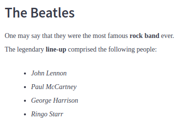
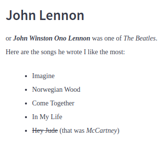
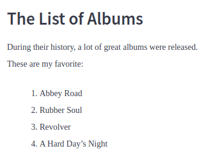

# Markdown Editor

## Project description

Markdown is a special plain text formatting language that is extremely popular among developers. It is used in documents, research articles, Github README files, and other things. In this project, you will write an editor that will be able to recognize several tags, structures, and save your results to a file. You will practice concepts frequently tested in technical interviews at top tech companies.

[View more](https://hyperskill.org/projects/162)


## Stage 1/5: Meet the markdown!

### Description

Welcome to the first stage of the project!

If you have worked with the markdown, you will probably recognize the following syntax:
```text
# The Beatles
One may say that they were the most famous **rock band** ever.
The legendary **line-up** comprised the following people:
* *John Lennon*
* *Paul McCartney*
* *George Harrison*
* *Ringo Starr*
```

Yes! It is a raw markdown code. It translates into:



### Objectives

Print the source (raw) markdown code of the markdown snippet below. Show your understanding of the syntax basics. You can use [the Markdown Guide](https://www.markdownguide.org/basic-syntax/) as it covers all the necessary topics.

Below is the snippet to complete this stage. Here you can see such elements as the **heading**, the **italicized** text, the **strikethrough** text, the text both **italicized** and **bold** (you can surround it with triple `*` on each end, for instance: `***Lennon***`), and an **unordered list**. Once you write the snippet in the markdown syntax, put it into triple quotes and print it:



### Example

Take a look at the snippet below. This example is for reference only.



To reconstruct the snippet's structure with markdown, you would have needed to print the following:
```text
# The List of Albums
During their history, a lot of great albums were released.
These are my favorite:
1. Abbey Road
2. Rubber Soul
3. Revolver
4. A Hard Day's Night
```


## Stage 2/5: How do I use it?

### Description

Before we start implementing the project, we need to think about the functionality. Remember [the Markdown Guide](https://www.markdownguide.org/basic-syntax/) from the previous stage? Let's go through it one more time and recall the basic features:

- plain — a normal text without any formatting
- bold/italic — self-explanatory
- inline-code — for example, `python editor.py`
- link — for example, [google.com](https://google.com/)
- header — look at the header of this stage.
- unordered-list — this very list is an example of an unordered list
- ordered-list — a list with enumerated elements
- new-line — switches to the next line

In this stage, you need to implement these features in your editor. Let's also add special commands to our tool:

- `!help` — prints available syntax commands.
- `!done` — saves the markdown and exits the app.

Let's do it!

### Objectives

Implement the help function (`!help`) that will print available syntax commands, which we have indicated above, as well as the special commands. When called, it should print the following:
```text
Available formatters: plain bold italic header link inline-code ordered-list unordered-list new-line
Special commands: !help !done
```

Implement the exit function (`!done`) that exits the editor without saving.

Ask a user for input: `Choose a formatter:`.

- If the input contains one of the correct formatters (plain, bold, italic, etc.), ask for the input once again.
- If the input contains no formatters or unknown command is sent, print the following message and ask for input again: `Unknown formatting type or command`.
- If the input contains `!help`, print the list of available commands, as shown in the example below. If the input contains `!done`, exit the editor without saving.

### Example

The greater-than symbol followed by a space (`> `) represents the user input. Note that it's not part of the input.

**Example 1:**
```text
Choose a formatter: > non-existing-formatter
Unknown formatting type or command
Choose a formatter: > !help
Available formatters: plain bold italic header link inline-code ordered-list unordered-list new-line
Special commands: !help !done
Choose a formatter: > header
Choose a formatter: > ordered-list
Choose a formatter: > !done
```


## Stage 3/5: Text formatting

### Description

Congratulations! You've made it to the most interesting part of the project. Now we will try to implement the formatters that we have discussed before:

- plain
- bold/italic
- inline-code
- link
- header
- new-line

We do not include ordered and unordered lists, for now. This also means that you should delete them from the list shown when a user asks for the !help function. But we will get to them in the next stage!

### Objectives

Implement a separate function for each of the formatters. It will keep your code structured. With functions, you will also be able to find and fix a bug with ease if something is wrong.

The program should work in the following way:

1. Ask a user to input a formatter.
2. If the formatter doesn't exist, print the following error message: `Unknown formatting type or command`.
3. Ask a user to input a text that will be applied to the formatter: `Text: <user's input>`.
4. Save the text with the chosen formatter applied to it and print the markdown. Each time you should print out the whole text in markdown accumulated so far.

Different formatters may require different inputs. You can find detailed examples in the Examples section below.

1. **Headings** require a **level** and a **text** to print. The level is a number from 1 to 6. If the input number is out of bounds, print the corresponding error: `The level should be within the range of 1 to 6` and ask the user for input again. A heading should always be printed on a new line and automatically add a new line at the end:
    ```text
    Choose a formatter: > header
    Level: > 4
    Text: Hello World!
    #### Hello World!
    ```

2. **Plain**, **bold**, **italic**, and **inline-code** formatters require only text input. They should **not** add an extra space or line break at the end and should add a new formatted text to the previously formatted one (you do **not** need to print the new formatted text on a new line).

3. The **new-line** formatter does not require text input.

4. **Link** requires a **label** and a **URL**. This formatter should not add an extra space or line break at the end.
    ```text
    Choose a formatter: > link
    Label: > Tutorial
    URL: > https://www.markdownguide.org/basic-syntax/
    [Tutorial](https://www.markdownguide.org/basic-syntax/)
    ```

### Examples

The greater-than symbol followed by a space (`> `) represents the user input. Note that it's not part of the input.

**Example 1:** *printing a heading.*
```text
Choose a formatter: > header
Level: > 10
The level should be within the range of 1 to 6
Level: > 4
Text: Hello World!
#### Hello World!

Choose a formatter: > 
```

**Example 2:** *printing a heading after some other text; the heading is on a new line and another new line is added right after it.*
```text
Choose a formatter: > bold
Text: > Hello
**Hello**
Choose a formatter: > header
Level: > 2
Text: > Hello World!
**Hello**
## Hello World!

Choose a formatter: >
```

**Example 3:** *working with the plaintext , inline-code, and new-line formatters; mind that the new-line formatter does not require text input.*
```text
Choose a formatter: > plain
Text: > raw text
raw text
Choose a formatter: > inline-code
Text: > code.format()
raw text`code.format()`
Choose a formatter: > new-line
raw text`code.format()`

Choose a formatter: >
```

**Example 4:** *working with the bold and link formatters.*
```text
Choose a formatter: > bold
Text: > You can use the following link:
**You can use the following link:**
Choose a formatter: > link
Label: > Tutorial
URL: > https://www.markdownguide.org/basic-syntax/
**You can use the following link:**[Tutorial](https://www.markdownguide.org/basic-syntax/)
Choose a formatter: >
```

**Example 5:** *working with the header formatter; it automatically adds a line break, that's why the next formatted text (the link) is printed on a new line.*
```text
Choose a formatter: > non-existing-formatter
Unknown formatting type or command
Choose a formatter: > header
Level: > 4
Text: > Hello World!
#### Hello World!

Choose a formatter: > plain
Text: > Some plain text
#### Hello World!
Some plain text
Choose a formatter: > new-line
#### Hello World!
Some plain text

Choose a formatter: > link
Label: > Tutorial
URL: > https://www.markdownguide.org/basic-syntax/
#### Hello World!
Some plain text
[Tutorial](https://www.markdownguide.org/basic-syntax/)
Choose a formatter: > !done
```
