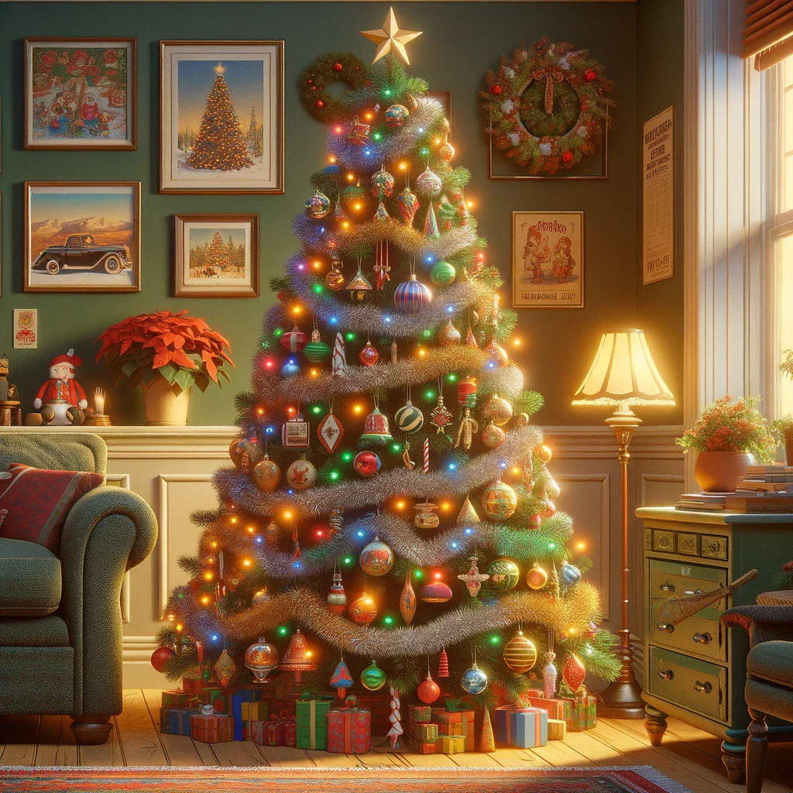
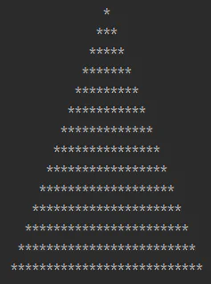
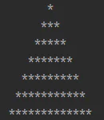
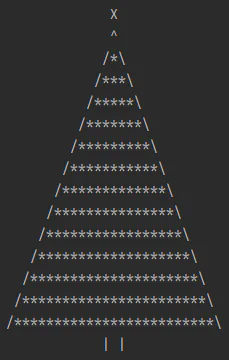
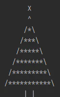
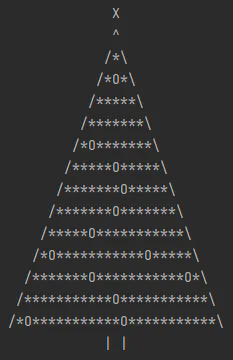
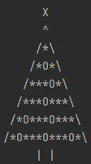

# X-mas Tree

## Project description

Welcome to a fun project that takes us back to the '80s and the world of ASCII characters. If you have ever been tasked with drawing a Christmas tree using asterisks in your programming journey, this project is for you. Drawing an entire Christmas card will make the task a bit more challenging. Get ready to have some fun!

[View more](https://hyperskill.org/projects/391)

## Stage 1/6: Reach for the stars

### Description

You have decided to write a generator of Christmas cards stylized as old graphics consisting of ASCII characters, but you have to start somewhere. Try to draw a Christmas tree consisting only of stars.

### Objectives

1. Write a script that asks for the height of the Christmas tree Y.
2. Draw a Christmas tree with height Y.
3. The top of the Christmas tree is one character `*`.
4. Each lower level equals the higher level, with one star added to the left and one to the right.
5. The lowest possible Christmas tree will have 3 levels.
6. For a height of 3, it should look like this (the numbers on the X and Y axes are for illustrative purposes only):

    |     |  0  |  1  |  2  |  3  |  4  |
    | --- | --- | --- | --- | --- | --- |
    |  0  |     |     |  *  |     |     |
    |  1  |     |  *  |  *  |  *  |     |
    |  2  |  *  |  *  |  *  |  *  |  *  |

### Examples

The greater-than symbol followed by a space (`> `) represents the user input. Note that it's not part of the input.

**Example 1:** *14 lines*

`> 14`

**Example 2:** *7 lines*

`> 7`

## Stage 2/4: More details

### Description

To enhance the appearance of the Christmas tree, which currently looks like a triangle made of stars, we will incorporate a few additional elements. Firstly, we will add a decorative item on the top. Secondly, we will encircle the tree with a line. And lastly, we will attach a stem at the bottom.

To make it easier, try to create a function that can insert the Christmas tree into a table of `WIDTH * HEIGHT` size, where the size of the table is equal to the width and height of the drawn Christmas tree.

### Objectives

1. Add the `X` tip to the top.
2. At the bottom, in the middle, add a stem consisting of two characters `|` separated by a space `| |`.
3. As a result, the height of the Christmas tree will be two levels higher.
4. Replace the asterisk, which has been a tip so far, with the `^` sign.
5. Replace the outermost asterisks on the left side with `/` and on the right side with `\`.
6. The tree for a height of 4 should look like this:

|     |  0  |  1  |  2  |  3  |  4  |  5  |  6  |
| --- | --- | --- | --- | --- | --- | --- | --- |
|  0  |     |     |     |  X  |     |     |     |
|  1  |     |     |     |  ^  |     |     |     |
|  2  |     |     |  /  |  *  |  \  |     |     |
|  3  |     |  /  |  *  |  *  |  *  |  \  |     |
|  4  |  /  |  *  |  *  |  *  |  *  |  *  |  \  |
|  5  |     |     | \|  |     | \|  |     |     |

### Examples

The greater-than symbol followed by a space (`> `) represents the user input. Note that it's not part of the input.

**Example 1:** *14 lines*

**Example 2:** *7 lines*

## Stage 3/4: Christmas decorations

### Description

There's only one thing missing from the Christmas tree — decorations. We will try to place Christmas trinkets on it. But to make it more realistic, we will put them in different configurations.

### Objectives

1. In the input, in addition to the height of the Christmas tree, we also provide the interval at which the decorations appear after one space. The interval must always be greater than 0.
2. Decorations `O` can only be placed in places marked with numbers. Each subsequent level will have one more decoration. For example, let's take the height of a Christmas tree is 5.

|     |  0  |  1  |  2  |  3  |  4  |  5  |  6  |  7  |  8  |
| --- | --- | --- | --- | --- | --- | --- | --- | --- | --- |
|  0  |     |     |     |     |  X  |     |     |     |     |
|  1  |     |     |     |     |  ^  |     |     |     |     |
|  2  |     |     |     |  /  |  *  |  \  |     |     |     |
|  3  |     |     |  /  |  *  |  1  |  *  |  \  |     |     |
|  4  |     |  /  |  *  |  2  |  *  |  3  |  *  |  \  |     |
|  5  |  /  |  *  |  4  |  *  |  5  |  *  |  6  |  *  |  \  |
|  6  |     |     |     | \|  |     | \|  |     |     |     |

If the interval is 1, Christmas decorations should appear in all places marked with numbers:

|     |  0  |  1  |  2  |  3  |  4  |  5  |  6  |  7  |  8  |
| --- | --- | --- | --- | --- | --- | --- | --- | --- | --- |
|  0  |     |     |     |     |  X  |     |     |     |     |
|  1  |     |     |     |     |  ^  |     |     |     |     |
|  2  |     |     |     |  /  |  *  |  \  |     |     |     |
|  3  |     |     |  /  |  *  |  O  |  *  |  \  |     |     |
|  4  |     |  /  |  *  |  O  |  *  |  O  |  *  |  \  |     |
|  5  |  /  |  *  |  O  |  *  |  O  |  *  |  O  |  *  |  \  |
|  6  |     |     |     | \|  |     | \|  |     |     |     |

With the interval of 3, the decoration should appear every three places, in other words, in places marked 1, 4.

|     |  0  |  1  |  2  |  3  |  4  |  5  |  6  |  7  |  8  |
| --- | --- | --- | --- | --- | --- | --- | --- | --- | --- |
|  0  |     |     |     |     |  X  |     |     |     |     |
|  1  |     |     |     |     |  ^  |     |     |     |     |
|  2  |     |     |     |  /  |  *  |  \  |     |     |     |
|  3  |     |     |  /  |  *  |  O  |  *  |  \  |     |     |
|  4  |     |  /  |  *  |  *  |  *  |  *  |  *  |  \  |     |
|  5  |  /  |  *  |  O  |  *  |  *  |  *  |  *  |  *  |  \  |
|  6  |     |     |     | \|  |     | \|  |     |     |     |

### Examples

The greater-than symbol followed by a space (`> `) represents the user input. Note that it's not part of the input.

**Example 1:**

`> 14 6`

**Example 2:**

`>7 2`

